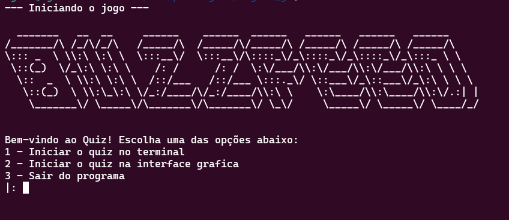
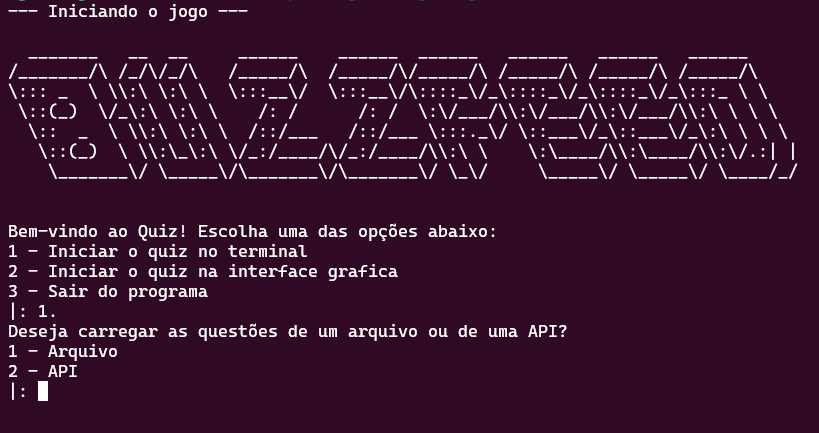
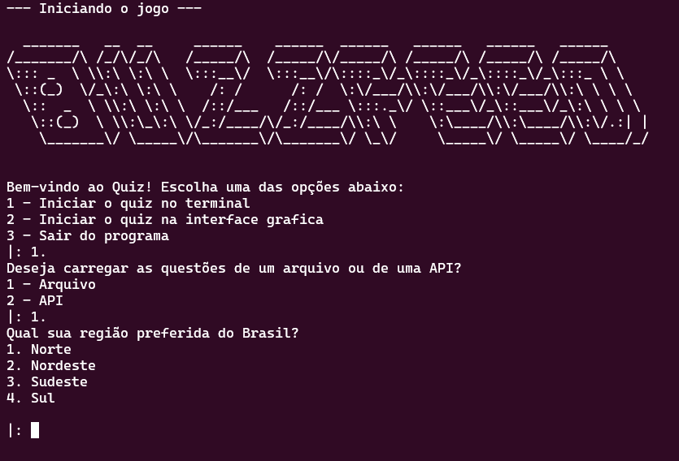
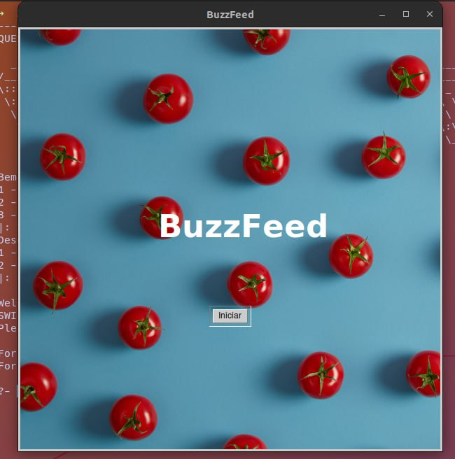
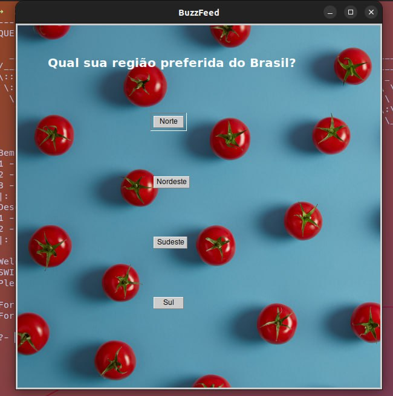
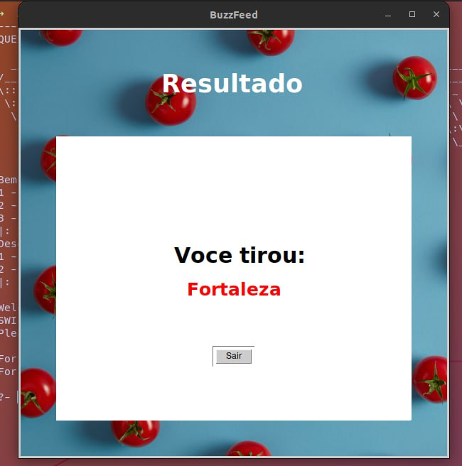

# BuzzFeed

**Disciplina**: FGA0210 - PARADIGMAS DE PROGRAMAÇÃO - T01 <br>
**Nro do Grupo**: 02<br>
**Paradigma**: Lógico<br>

## Alunos

| Matrícula  | Aluno                             |
| ---------- | --------------------------------- |
| 19/0041871 | Abner Filipe Cunha Ribeiro        |
| 19/0102390 | André Macedo Rodrigues Alves      |
| 19/0012307 | Eduardo Afonso Dutra Silva        |
| 18/0018728 | Igor Batista Paiva                |
| 18/0033620 | João Henrique Cunha Paulino       |
| 16/0152615 | João Pedro Elias de Moura         |
| 18/0054554 | Paulo Batista                     |
| 19/0019158 | Rafael Leão Teixeira de Magalhães |
| 19/0020903 | Vitor Magalhães Lamego            |

## Sobre

O projeto baseaia-se nos testes criados e disponíveis na plataforma BuzzFeed. Os testes são formados por perguntas de multipla escolha (geralmente relacionadas a personalidade e opiniões do usuário) em que não existem alternativas certas ou erradas. O usuário deve responder todas as perguntas presentes no quizz e ao final as respostas são analisadas e o resultado que mais se encaixa no perfil do usuário é apresentado.

## Screenshots

### Tela inicial CLI



### Tela opções questões CLI



### Tela pergunta



### Tela Inicial GUI



### Tela Pergunta GUI



### Tela Resultado GUI



## Instalação

**Linguagens**: Prolog e Python<br>
**Tecnologias**: XPCE e Flask<br>
Descreva os pré-requisitos para rodar o seu projeto e os comandos necessários.
Insira um manual ou um script para auxiliar ainda mais.
Gifs animados e outras ilustrações são bem-vindos!

## Uso

Existem duas principais maneiras de rodar esse projeto, a primeira utilizando o Dockerfile e a segunda o Makefile. Caso você não queira instalar o swipl diretamente em sua máquina, use o Docker. Porém, se você já tiver o swipl ou pretende instalar, use o comando `make`.

OBS: não é possível executar com a interface gráfica usando docker, será necessário utilizar o swipl (com o make), mas ainda é possível executar com a API executando com o docker.

### Exemplo utilizando o Docker

#### Pré-requisitos

- O [Docker](https://www.docker.com/) deve estar instalado em sua máquina.

#### Executando API e CLI

Para executar a API e a CLI com o docker é possível utilizar o script `start_all`, pode ser utilizado pelo make ou executando direto pelo bash.

```bash
make start_all
# OU
bash scripts/start_all.sh
```

#### Executando apenas a API

Para executar a API e a CLI com o docker é possível utilizar o script `start_api`.

```bash
make start_api
# OU
bash scripts/start_api.sh
```

#### Parando e removendo todos os containers

Para parar e remover todos os containers do docker é possível utilizar o script `stop_all`.

```bash
make stop_all
# OU
bash scripts/stop_all.sh
```

#### Parando e removendo o container da API

Para parar e remover apenas o container da API é possível utilizar o script `stop_api`.

```bash
make stop_api
# OU
bash scripts/stop_api.sh
```

#### Parando e removendo todos os containers e imagens

Para parar e remover todos os containers e imagens é possível utilizar o script `remove_all`.

```bash
make remove_all
# OU
bash scripts/remove_all.sh
```

#### Parando e removendo os containers e imagens da API

Para parar e remover apenas o container e imagem da API é possível utilizar o script `remove_api`.

```bash
make remove_api
# OU
bash scripts/remove_api.sh
```

### Exemplo utilizando o Makefile

#### Pré-requisitos

- [SWI-Prolog](https://www.swi-prolog.org/), o ambiente Prolog que será utilizado para rodar o programa.
- Comando `make`, disponível por padrão na maioria das distribuições linux.

#### Rodando o projeto

No diretório raiz, simplesmente digite o comando `make` em seu terminal. Caso você não possua o comando make, ainda é possível rodar o projeto diretamente digitando `swipl -O -s src/main`.

OBS: se desejar consumir perguntas da API, será necessário iniciar a API.

## Vídeo

Adicione 1 ou mais vídeos com a execução do projeto.
Procure:
(i) Introduzir o projeto;
(ii) Mostrar passo a passo o código, explicando-o, e deixando claro o que é de terceiros, e o que é contribuição real da equipe;
(iii) Apresentar particularidades do Paradigma, da Linguagem, e das Tecnologias, e
(iV) Apresentar lições aprendidas, contribuições, pendências, e ideias para trabalhos futuros.
OBS: TODOS DEVEM PARTICIPAR, CONFERINDO PONTOS DE VISTA.
TEMPO: +/- 15min

## Participações

Apresente, brevemente, como cada membro do grupo contribuiu para o projeto.
|Nome do Membro | Contribuição | Significância da Contribuição para o Projeto (Excelente/Boa/Regular/Ruim/Nula) |
| -- | -- | -- |
| Fulano | Programação dos Fatos da Base de Conhecimento Lógica | Boa |

## Outros

Quaisquer outras informações sobre o projeto podem ser descritas aqui. Não esqueça, entretanto, de informar sobre:
(i) Lições Aprendidas;
(ii) Percepções;
(iii) Contribuições e Fragilidades, e
(iV) Trabalhos Futuros.

## Fontes

Referencie, adequadamente, as referências utilizadas.
Indique ainda sobre fontes de leitura complementares.
